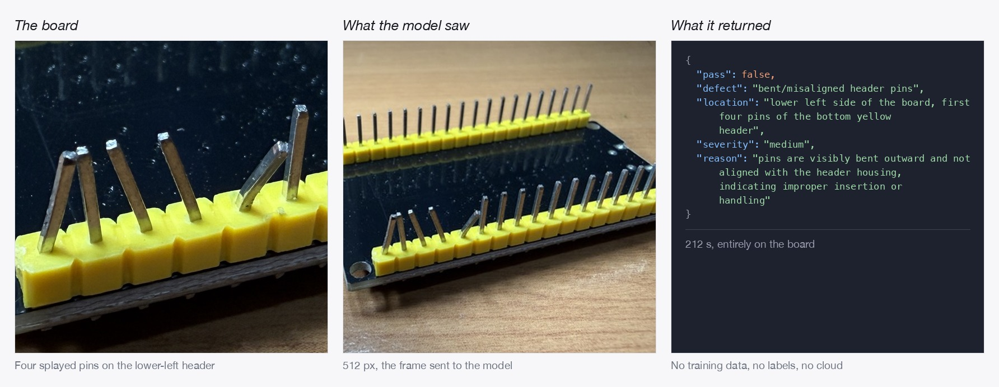
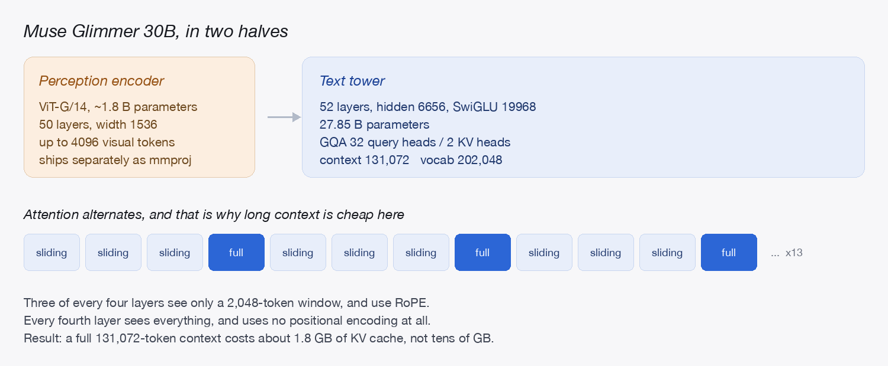
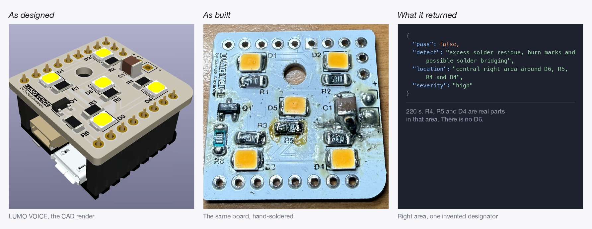
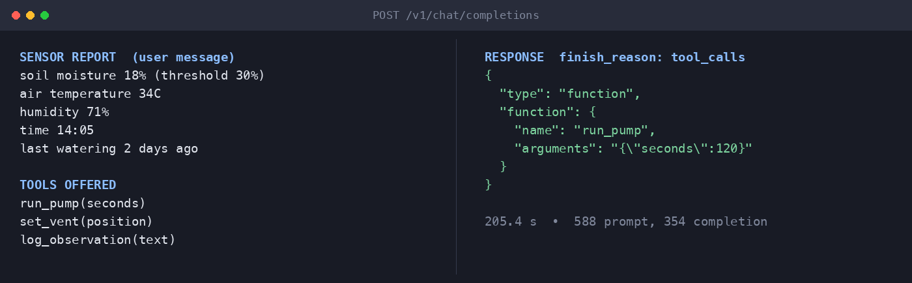
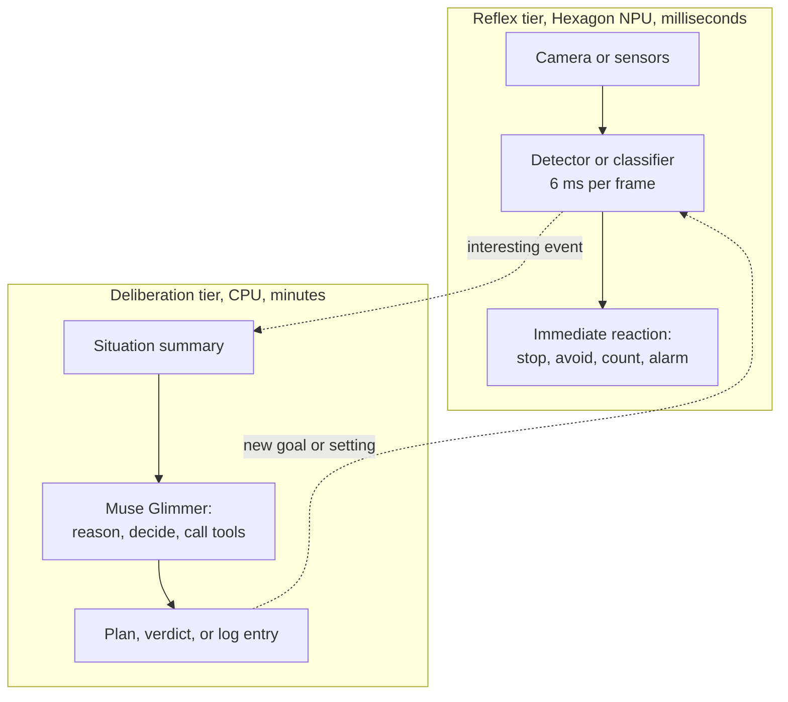
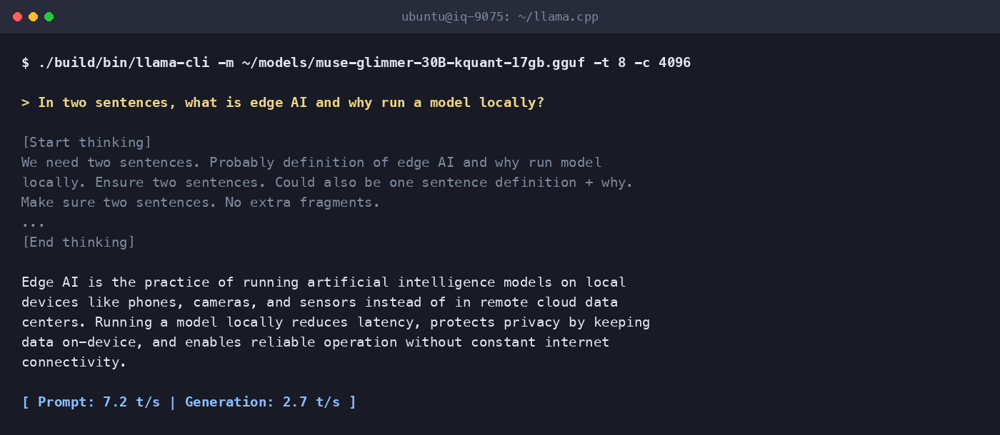

# Muse Glimmer 30B on Dragonwing IQ-9075: An LLM That Sees

Run Meta's 30B vision-language model entirely on a Dragonwing IQ-9075. Zero-shot defect inspection, tool calling and 128K context, no cloud.

**Author:** Samuel Alexander  
**Target:** Qualcomm Dragonwing IQ-9075 EVK  
**Model:** Meta Muse-Glimmer-30B (Apache-2.0), Meta's official GGUF build  
**Runtime:** llama.cpp, CPU backend  
**Measured:** 21.6 GB resident for a 30B model with its full 131K context, 8.13 tokens/s prefill, 2.84 tokens/s generation  
**Difficulty:** Intermediate  
**Time:** About an hour, most of it downloading 16.8 GB  
**Repository:** https://github.com/SamuelAlexander/dragonwing-muse-glimmer-30b



I gave the board a photo of a PCB I had built badly on purpose and asked it, in plain English, to look for manufacturing defects. This is zero-shot: the model has never seen this board, this defect, or any inspection dataset of mine. It works from what it already knows. It looked the board over and came back with this:

```json
{"pass": false,
 "defect": "bent/misaligned header pins",
 "location": "lower left side of the board, first four pins of the bottom yellow header",
 "severity": "medium",
 "reason": "pins are visibly bent outward and not aligned with the header housing, indicating improper insertion or handling"}
```

That is correct. The lower-left header does have four splayed pins. Nothing left the board to work it out.

## Where this model comes from

Open-weight models have spent the last couple of years getting smaller and better at once. The releases that matter stopped being the ones that broke a benchmark and started being the ones you could put somewhere: a laptop, a workstation, a single GPU. The question changed with them. It used to be whether a model could write well. Now it is whether a model can *do* things: read a screenshot, pick the right function to call, notice its own last step failed and try again.

Muse Glimmer is Meta's entry in that direction, released in August 2026 under Apache-2.0. Roughly 30 billion parameters, about 1.8 billion of them a vision encoder at the front, distilled from Meta's larger Muse Spark. Meta positions it against Gemma4-31B and Qwen3.6-27B, so it is competing in its weight class rather than claiming the frontier. What it was tuned for is the interesting part: long-horizon tasks, tool calling with strict schemas, interleaved text and images, a 131,072-token context, and recovering from its own mistakes instead of stopping. Support landed everywhere on day zero, llama.cpp included, which is what runs it here.



Most of what has been written since release runs it on a fast GPU as a coding assistant, and it is good at that. There is a second question worth asking, though, and it is the one this guide is about: **what happens when you hand a model like this to a board that lives on a factory floor or in a greenhouse.**

## Why a model like this changes what a board can do

A model that can see and act is a different proposition from one that can only talk, especially on hardware that lives somewhere rather than sitting on a desk.

This board already has fast reflexes. It runs YOLOv11 object detection on its Hexagon NPU at 166 FPS, which I measured in [an earlier guide in this series](https://github.com/SamuelAlexander/dragonwing-yolov11-cpu-to-npu): six milliseconds per frame, all day, barely warm. What a detector gives you is coordinates and a label. It cannot tell you the pins are bent, or that the residue near the capacitor looks like a bridge rather than flux, or read a sensor report and decide to run the pump for two minutes.

That gap is the whole point. Perception tells you what is there. Judgement tells you what it means and what to do about it, and until recently judgement lived in a data centre.

The two work at completely different speeds, and that turns out to be the design principle rather than a disappointment:


Three things follow from having judgement on the device:

**Nothing leaves.** The inspection photos in this guide never touched a network. For a factory line, a clinic, or anything under an NDA, that is often the only acceptable arrangement, and it is a hard requirement rather than a preference.

**No connection required.** A greenhouse, a remote pump station, a vehicle. The model does not care whether the link is up.

**You retask it by talking to it.** This is the one that surprised me most, and there is a demonstration of it below. Changing what a conventional vision model looks for means collecting images, labelling them, training and validating. Changing what this one looks for means editing a sentence.

The rest of this guide is about giving the board a deliberate mind alongside the reflexes it already has, and being straight about what that costs.

## Terms used in this guide

| Term | Meaning |
|---|---|
| **GGUF** | The single-file model format llama.cpp loads: weights, tokenizer and chat template together. |
| **Prefill** | Reading the prompt before any reply begins. Sets how long you wait for the first word. |
| **Generation** | Producing the reply one token at a time. This is the speed you feel while reading along. |
| **Dense model** | Every weight participates in every token. The opposite is Mixture-of-Experts, where only a fraction does. This distinction explains the whole performance story below. |
| **Perception encoder** | The vision half of the model. Turns an image into tokens the language half can read. |
| **KV cache** | Working memory for the conversation so far, so the model does not re-read it every token. |

## What the model can do on this board

Three demonstrations, one per capability. Every output below is verbatim from a run on the board, and every timing is wall clock from that same run. Raw logs are in [`results/`](results/).

### 1. It can look at something and judge it

The inspection above was not a special build or a fine-tuned model. It was the stock model, one photo, and this instruction:

```
Inspect this circuit board for manufacturing defects. Reply with ONLY a JSON object
and nothing else: {"pass": true|false, "defect": "...", "location": "...",
"severity": "low|medium|high", "reason": "..."}
```

Point it at a different board and the same instruction still works. This is LUMO VOICE, a board I designed for [a keyword-spotting project](https://docs.edgeimpulse.com/projects/expert-network/synthetic-data-pipeline-keyword-spotting) where the lights turn on and off on a wake word, detected entirely on the device. This particular unit was hand-soldered and it shows: flux residue everywhere and a scorched area near the capacitor.

```json
{"pass": false,
 "defect": "excess solder residue, burn marks and possible solder bridging",
 "location": "central-right area around D6, R5, R4 and D4",
 "severity": "high",
 "reason": "visible brown burn/discoloration and solder splatter around D6, R5, R4 and D4 with irregular solder deposits suggesting overheating or bridging, compromising reliability"}
```



Worth reading that one carefully, because it shows the edge of what the model can do. The area it points at is right: R4, R5 and D4 really are the parts clustered around the damage. But **there is no D6 on this board**. It runs D1 to D5. The model read the silkscreen well enough to name three real components and then invented a fourth that fits the pattern.

That is the failure mode to design around. Trust it on *what kind of problem and roughly where*, and verify anything it names in fine print. A verdict is a place to look, not a work order.

Now change one sentence of the instruction, and watch the output change shape with it:

```
Check only one thing on this circuit board: are all header pins straight and parallel?
Reply with ONLY a JSON object and nothing else:
{"pins_ok": true|false, "bent_count": number, "note": "..."}
```

```json
{"pins_ok": false, "bent_count": 4,
 "note": "Several header pins on the lower left side of the board are bent outward and not parallel with the rest of the pins."}
```

Four is the right answer.

**This is the part worth sitting with.** Retargeting a conventional vision model means collecting images, labelling them, training, and validating. Retargeting this one meant editing a sentence. If you have ever lost a fortnight to labelling, that trade is the whole story, and it is exactly the trade an industrial inspection line cares about.

The honest cost: about three and a half minutes per verdict at 512 pixels.

| What | Time |
|---|---|
| Encoding the image (the vision half) | 34.0 s |
| Whole run, image to JSON, low reasoning | 212.2 s |
| Same board, retasked question | 194.8 s |
| LUMO VOICE board, same instruction | 220.1 s |

Two things I measured that are worth knowing before you build anything on this:

**Image size is the lever that works.** A 1024 pixel image takes 131.9 s to encode against 34.0 s at 512 pixels, near enough four times the cost for twice the resolution. Feed it the smallest image that still shows the defect.

**`--image-max-tokens` is not a lever.** Capping visual tokens at 256 changed the run from 189.4 s to 189.2 s. The vision encoder does its work regardless. Downscale the image instead.

### 2. It can decide and act

Tool calling is what Meta built this model around, and it works here. I gave it three greenhouse tools (`run_pump`, `set_vent`, `log_observation`) and a sensor report: soil moisture 18% against a 30% threshold, air 34 C, humidity 71%, last watered two days ago.



Correct tool, sensible argument. It chose to water rather than to vent, and it called one tool rather than a chain of them.

**Where this fits architecturally.** Nobody wants a 205-second control loop. But that is not what a model like this is for. The pattern that works on hardware like this is two tiers running at different speeds:



The reflex tier never blocks. It runs on the NPU at frame rate and handles anything that must happen now. The deliberation tier wakes on events that deserve thought, takes its time, and hands back a decision, a verdict, or a line in a log. A planner that thinks for a few minutes is ordinary; a brake that thinks for a few minutes is not.

I have not built that integrated loop here, and this guide does not pretend otherwise. Both halves are proven separately on this board, and joining them is its own project.

### 3. It can hold a manual in its head

Muse Glimmer's context window is 131,072 tokens. On most hardware that is an expensive promise, because conversation memory usually grows fast enough to dominate your RAM.

Not here, and the reason is in the architecture. Three of every four layers use a 2,048-token sliding window, so only 13 of the 52 layers carry the full context. Each layer shares its keys and values across 16 attention heads. The result:

| Context | KV cache |
|---|---|
| 39 sliding-window layers, capped at 2,048 | about 0.08 GB |
| 13 full-attention layers, at 131,072 | about 1.74 GB |
| **Full 131K context** | **about 1.8 GB** |

A conventional 30B with plain attention would need tens of gigabytes for the same window. So the whole thing, model plus drafter plus vision encoder plus a full-length conversation, sits at roughly 21.6 GB of the board's 34 GB.

To test that with something real, I fed the board its own documentation: 96,951 characters of Qualcomm's published IQ-9075 pages, covering the SoC, interfaces, camera, audio, USB, PCIe, Ethernet, Wi-Fi, sensors, power and display. Then I asked it questions whose answers are checkable against the source.

Reading it took **66 minutes**. That is the honest number and it is a real cost. But it is paid once:

| Step | Tokens | Time |
|---|---|---|
| Reading the documentation | 26,285 | 3,999 s |
| Question 1 | 25 new, 26,286 cached | 134 s |
| Question 2 | 53 new, 26,312 cached | 107 s |
| Question 3 | 88 new, 26,366 cached | 80 s |
| Question 4 | 16 new, 26,557 cached | 51 s |

After the first call, every question reuses the context already sitting in the KV cache. Only the new tokens are read. An hour of reading buys you a board that answers questions about its own hardware in about a minute, offline, for as long as the process stays up.

The answers are checkable, which is the point of using real documentation:

```
Q: How much RAM does this board have, and what type and speed is it?
A: From the documentation:
   * Device specifications: "RAM: Up to 36 GB LPDDR5 @ 3200 MHz with inline ECC"

Q: What storage options are available on this board?
A: Storage options on the Dragonwing IQ-9075 EVK:
   * Device specifications:
     `Storage: UFS 3.1 (up to 128 GB), NVMe via PCIe`
   * Hardware Specifications:
     `Storage 2 x 128 GB UFS, micro-SD card, EEPROMs for MACs, eMMC on mezzanine card`
```

My favourite answer was the one I did not plan for. Asked about wireless support, it returned this:


Two pages in the same documentation set give slightly different Bluetooth versions. Rather than pick one and sound confident, the model quoted both and named where each came from, which is exactly the prompt to go and check. So I asked the board:

```bash
hciconfig -a | grep -E "HCI Version|LMP Version"
```

```
HCI Version: 5.3 (0xc)  Revision: 0x0
LMP Version: 5.3 (0xc)  Subversion: 0x8674
```

The summary table has it right: this EVK does Bluetooth 5.3, reported by the controller itself at both HCI and LMP level. The 5.2 on the interface page looks like a line written against an earlier firmware revision, which is the kind of drift any large documentation set collects over time.

The behaviour is what I want to draw out, though. A model that answers a spec question by naming its sources hands you something you can verify in one command. A model that quietly reconciles two sources into one confident sentence hands you nothing, and here it would have had even odds of being wrong.

**You do not have to pay that hour twice.** Start the server with `--slot-save-path`, and once the document is read you can write the cache to disk and load it back later:

```bash
curl -X POST "http://localhost:8080/slots/0?action=save" \
  -H "Content-Type: application/json" -d '{"filename":"manual.bin"}'

curl -X POST "http://localhost:8080/slots/0?action=restore" \
  -H "Content-Type: application/json" -d '{"filename":"manual.bin"}'
```

I verified this round-trips on a short context: 66 tokens saved in 2.4 ms and restored in 1.5 ms. The cache runs about 53 KB per token, so the full 26,285-token manual lands in the region of a few hundred megabytes on disk. I have not round-tripped the whole document myself, so treat the exact size and timing as untested, but the mechanism works.

> **Gotcha: save the slot your context is actually in.** The server splits its context across four slots by default. Running exactly the commands above against a default server returned `"n_saved": 0` and a 28-byte file, because slot 0 was not the slot that had served the request. Start the server with `--parallel 1`, as the document session above does, and there is only one slot to think about.

## The shape of the machine

Generation runs at 2.84 tokens/s. That is a reading pace rather than a chat pace, and the reason is worth understanding, because it is a property of the model rather than of the silicon.

Muse Glimmer is **dense**, so producing one token reads every weight in the file: 15.6 GB of traffic from memory, per token. The best read bandwidth I could measure on this board, using a pure-read microbenchmark with nothing else running, is 52 GB/s. At 2.84 tokens/s the model is moving 47.5 GB/s of weights, which is **91% of that figure while also doing all the arithmetic**.

There is no tuning left to find. llama.cpp is running this about as well as the memory allows.

Two consequences follow, and both are useful when you plan a project around a local model.

**Quantizing harder barely helps.** Speed scales with file size, so the entire published quantization ladder for this model, from roughly 10.8 GB to 26 GB, spans under a factor of two in speed. You would trade real quality for a fraction of a token per second.

**Model architecture matters more than the accelerator.** A Mixture-of-Experts model of similar total size activates only a fraction of its weights per token, so it streams a fraction of the bytes and generates several times faster on this same board. That is the direct route to interactive speed here, and it is a different guide.

Use all eight cores:

| Threads | Prefill (512 tokens) | Generation (64 tokens) |
|---|---|---|
| 4 | 4.20 tokens/s | 2.02 tokens/s |
| 8 | 8.13 tokens/s | 2.84 tokens/s |

**Speculative decoding did not help here.** Meta ships a DFlash drafter with the model and reports speedups of 1.5x to 3.1x on GPUs and Apple silicon. On this board I measured 2.8 tokens/s without it, 2.9 with it, and 1.9 with a larger draft window and greedy sampling. Note that `-md` alone does nothing: you also need `--spec-type draft-dflash`. This is what I measured on this board, not a verdict on the technique.

## An ecology of models

The interesting question for this board is not which single model to run, but which tier each job belongs to.

| Tier | Runs on | Timescale | Good for |
|---|---|---|---|
| Reflex | Hexagon NPU | milliseconds | Detection, classification, segmentation, keyword spotting |
| Deliberation | CPU, this guide | minutes | Judgement, planning, tool use, reading documents |
| Interactive language | Hexagon NPU, via Genie | seconds | Chat and assistants, using a supported architecture |

That third row is worth knowing about. Qualcomm's Genie runtime runs LLMs on this board's NPU from precompiled per-architecture binaries, and its catalogue covers Llama, Qwen, Phi and Falcon. If you want conversational speed on this hardware today, that is the path.

Muse Glimmer is not in that catalogue yet. Its hybrid attention, which alternates three sliding-window layers with one full-attention layer that uses no positional encoding at all, is not in any converter as I write this, and the model is days old. That is a matter of the toolchain catching up rather than anything the silicon lacks: the same thing was true of every architecture now on that list. When Genie support does arrive, this model moves to the NPU and the arithmetic stops being the CPU's problem. Worth re-checking `apt search genie` and the AI Hub model list before you assume the numbers in this guide are still the best available.

llama.cpp also has a Hexagon backend that supports Snapdragon ARM64 Linux and builds the `v73` HTP library this board uses. It offloads only `Q4_0`, `Q8_0` and `MXFP4` weights, and no Muse Glimmer build exists in those formats today. Worth revisiting as the ecosystem catches up with a model this new.

Some pairings that follow naturally from the two-tier pattern, none of which I have built here: a detector on the NPU that wakes the language model only when something enters frame, so you get continuous watching at occasional-thinking cost; speech-to-text on the NPU feeding a local assistant that never sends audio anywhere; a maintenance log written in English overnight from a day of sensor events.

## Run it yourself

Everything below runs on the board. The model is public, so there is no account, no token, and no host-side tooling.

### Prerequisites

An IQ-9075 EVK running Ubuntu 24.04 and reachable over SSH. If you have not set the board up, follow Qualcomm's guide first: [set up the device](https://dragonwingdocs.qualcomm.com/Ubuntu/devices/iq9075-evk/set-up-the-device). You also need about 20 GB free:

```bash
df -h /
```

### Step 1: build llama.cpp

Muse Glimmer support is upstream, so a normal build is all it takes. The board ships without a compiler toolchain:

```bash
sudo apt update && sudo apt install -y cmake build-essential libcurl4-openssl-dev
```

```bash
cd ~
git clone --depth 1 https://github.com/ggml-org/llama.cpp
cd llama.cpp
cmake -B build -DGGML_NATIVE=ON -DCMAKE_BUILD_TYPE=Release -DLLAMA_CURL=ON
cmake --build build -j8
```

`--depth 1` matters more than it looks: **24 seconds and 206 MB** on the board's Wi-Fi. Drop it and you pull llama.cpp's entire history instead, which was still downloading past 372 MB several minutes in when I timed it. You only need the current tree.

`-DGGML_NATIVE=ON` targets this board's Cortex-A78C cores directly, including the dot-product instructions the quantized kernels use. This guide was written against build `dd1ea52`; you need one from August 2026 or later.

### Step 2: download the model

```bash
mkdir -p ~/models && cd ~/models
curl -L -C - -O https://huggingface.co/meta-models/Muse-Glimmer-30B-GGUF/resolve/main/muse-glimmer-30B-kquant-17gb.gguf
curl -L -C - -O https://huggingface.co/meta-models/Muse-Glimmer-30B-GGUF/resolve/main/mmproj-kquant.gguf
```

The first file is 16.8 GB and took about 29 minutes here; the second is the 1.4 GB vision encoder. `-C -` makes both resumable, so re-run the same command if your connection drops.

### Step 3: chat with it

```bash
cd ~/llama.cpp
./build/bin/llama-cli -m ~/models/muse-glimmer-30B-kquant-17gb.gguf -t 8 -c 4096
```

> **Gotcha: always pass `-c`.** The model advertises a 131,072-token context and llama.cpp will try to honour it, which allocates around 30 GB and takes a 34 GB board to zero free memory. My first run took the board down hard enough to drop the SSH session. 4096 is plenty for a conversation and costs a few hundred MB.

Loading takes about 90 seconds the first time while 16.8 GB is read from disk. Then you get a prompt, and a real exchange looks like this, with most of the chain of thought cut for length:



The dim block is the model thinking out loud, and you pay for every token of it at the same 2.7 tokens/s. There is a way to turn that down, and it is not the flag you would expect. Step 4 has it.

### Step 4: inspect an image

This is the command behind the verdicts at the top of this guide:

```bash
./build/bin/llama-mtmd-cli \
  -m ~/models/muse-glimmer-30B-kquant-17gb.gguf \
  --mmproj ~/models/mmproj-kquant.gguf \
  --jinja -t 8 -c 8192 -n 500 \
  -sys "You are an automated PCB inspection system.

Reasoning strength: low." \
  --image board.jpg \
  -p 'Inspect this circuit board for manufacturing defects. Reply with ONLY a JSON object and nothing else: {"pass": true|false, "defect": "...", "location": "...", "severity": "low|medium|high", "reason": "..."}'
```

> **Gotcha: `--jinja` is required**, for images and for tool calling. Without it the CLI aborts on signal 6 with a backtrace and `what(): this custom template is not supported, try using --jinja`.

> **Gotcha: reasoning strength lives in the system message, not on the command line.** Muse Glimmer writes a chain of thought before answering, and it takes its instruction in-band: put `Reasoning strength: low.` (or `medium`, or `high`) as a line in the system prompt. The llama.cpp flags that look like they should do this (`--reasoning off`, `--reasoning-budget 0`, `--chat-template-kwargs '{"enable_thinking":false}'`) control how thought tags are *reported*, not whether the model emits them. I tested all three; the model reasoned every time. Switching from `high` to `low` took one verdict from 277.7 s to 212.2 s with no loss of correctness.

Sample images are in [`test-data/`](test-data/) if you want to reproduce the runs above.

### Step 5: serve it

```bash
./build/bin/llama-server -m ~/models/muse-glimmer-30B-kquant-17gb.gguf \
  -t 8 -c 4096 --jinja --host 0.0.0.0 --port 8080
```

Open `http://<board-ip>:8080` for the built-in web UI. The same endpoint speaks the OpenAI chat-completions API, including tools:

```bash
curl -s http://localhost:8080/v1/chat/completions -H "Content-Type: application/json" \
  -d '{"messages":[{"role":"user","content":"Reply with exactly: hello from the board"}],
       "max_tokens":250}'
```

> **Gotcha: an empty `content` field usually means `max_tokens` was too low.** Reasoning tokens count against your budget but come back separately in `message.reasoning_content`. The request above with `"max_tokens":40` spent all 40 inside the reasoning block and returned `content: ""`, which looks like a broken model rather than a truncated one. At 250 it used 117 tokens and answered correctly.

## Troubleshooting

**The board runs out of memory, or SSH drops while loading.** You left `-c` off, so llama.cpp allocated the full 131K context. Separately, expect SSH to be unresponsive while 16.8 GB is read from disk. Run long jobs under `setsid` with output to a log file rather than in a live session.

**`terminate called after throwing an instance of 'std::runtime_error'` from the multimodal CLI.** Add `--jinja`.

**`-no-cnv` does not stop it entering chat mode.** Current builds open the interactive chat UI regardless, and if you also redirect stdin from `/dev/null` it spins on end-of-input and writes an enormous log. For a single scripted prompt use `-st`.

**HTTP 400 from the server on a long document.** Your input is longer than the context you started the server with. Raise `-c`, and add `--parallel 1` so one slot gets the whole window instead of a quarter of it.

**`cmake: command not found`.** The board image ships without build tools. See Step 1.

## Results

| Measurement | Value |
|---|---|
| Model file | 16.76 GB on disk, 15.59 GiB loaded, 27.85 B parameters in the text tower |
| Prefill, 8 threads | 8.13 tokens/s |
| Generation, 8 threads | 2.84 tokens/s |
| Effective weight bandwidth during generation | 47.5 GB/s, 91% of measured peak read |
| Peak read bandwidth, pure-read microbenchmark | 52 GB/s at 4 threads on an idle board (49 GB/s re-measured warm) |
| Image encode, 512 px | 34.0 s |
| Image encode, 1024 px | 131.9 s |
| Image to JSON verdict, low reasoning | 212.2 s |
| Image to JSON verdict, high reasoning | 277.7 s |
| Tool call from a sensor report | 205.4 s |
| Full 131K context, KV cache | about 1.8 GB |

Raw logs for every number above are in [`results/`](results/).

## Project structure

```
.
├── scripts/
│   ├── inspect.sh        inspect one image, print a JSON verdict (Step 4)
│   ├── manual_qa.py      read a long document once, then ask questions about it
│   ├── fetch-manual.sh   rebuild that document from Qualcomm's published pages
│   └── membw.c           the memory-bandwidth probe behind the 52 GB/s figure
│   └── render-doc-assets.py  rebuilds every figure in this guide
├── results/              raw logs for every number in this guide
├── test-data/            the board photos used in the inspection runs
└── images/               figures used above
```

The diagram and the tables above are also in [`images/`](images/) as PNGs (`two-tier.png`, `results-table.png`, `project-structure.png`), for reposting anywhere that does not render mermaid or wide markdown tables.

To reproduce the bandwidth figure yourself:

```bash
gcc -O2 -o membw scripts/membw.c -lpthread
echo performance | sudo tee /sys/devices/system/cpu/cpu*/cpufreq/scaling_governor
./membw 4 8
echo schedutil | sudo tee /sys/devices/system/cpu/cpu*/cpufreq/scaling_governor
```

## Going further

- A Mixture-of-Experts model in this size class activates a fraction of its weights per token, which is the direct route to interactive speed on this board. The same llama.cpp build runs any GGUF.
- If you need an LLM on the NPU today, Qualcomm's Genie path covers Llama, Qwen, Phi and Falcon on this hardware.
- The two-tier pattern in this guide is worth building properly: a detector on the NPU deciding when the language model is worth waking. Both halves are proven separately here.
- Whatever you build, measure the bytes your model streams per token before you plan around its speed. On embedded hardware that number predicts more than the parameter count does.

## License

Apache-2.0. Muse Glimmer is also Apache-2.0.
